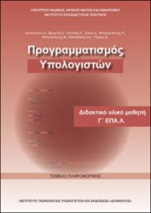

lass: cover-page, center, middle, inverse

ΠΡΟΓΡΑΜΜΑΤΙΣΜΟΣ
===========

## Γ' ΕΠΑΛ

### Τομέας Πληροφορικής



---
name: contents

## Περιεχόμενα

.contents[

]

---
layout: true

## Κεφάλαιο 3 - Βασικά στοιχεία γλώσσας προγραμματισμού

---

>Το **Ολοκληρωμένο Περιβάλλον Ανάπτυξης Προγραμμάτων** IDLE (Integrated 
DeveLopment Environment) της Python, είναι ένα Ελεύθερο Λογισμικό/ Λογισμικό Ανοικτού Κώδικα (ΕΛ/ΛΑΚ)

---
layout: true

## 3.1.1 Τύποι δεδομένων

---

>Οι τύποι δεδομένων προσδιορίζουν τον **τρόπο παράστασης** των δεδομένων εσωτερικά στον υπολογιστή, καθώς και το **είδος της επεξεργασίας** τους από αυτόν.

--- 

Οι χαρακτηριστικοί τύποι δεδομένων στην Python είναι:

- ο αριθμητικός.
    Οι αριθμοί στην Python είναι κυρίως τριών τύπων:
  - ακέραιοι (Integer)
  - αριθμοί κινητής υποδιαστολής (floating point)
  - μιγαδικοί αριθμοί (complex numbers), τύπος που δε θα μας απασχολήσει στη συνέχεια.
- ο λογικός (boolean): δέχεται μόνο δύο τιμές, την τιμή True (Αληθής) 
και την τιμή False (Ψευδής)

---

- οι συμβολοσειρές ή αλφαριθμητικά (strings): μια ακολουθία από χαρακτήρες. Μια συμβολοσειρά 
μπορεί να αποτελείται από περισσότερες από μία λέξεις. Μπορούμε να ορίσουμε μια συμβολοσειρά με μονά 
εισαγωγικά ή με διπλά, αλλά όχι ανάμικτα.

  -[Θέματα 2017 - Α1 Σωστό/Λάθος](https://apps1.minedu.gov.gr/themata/them_progyp_epal_c_hmer_170613.pdf)
  
  -[Θέματα 2024 - Α2 Αντιστοίχιση](https://apps1.minedu.gov.gr/themata/2024_06_them_sc_epal_240611.pdf)

.footnote[

]

---

### Άσκηση 1
> Για να ελέγξουμε τον τύπο δεδομένων χρησιμοποιούμε την συνάρτηση type().
```python
type(1)
type(3.14)
a = True
type(False)
type(‘Αρετή’)
```

-Τι θα εμφανίσει η κάθε γραμμή; Γιατί;

```python
# Παράδειγμα 1 - Ex01_first_prog.py
# -----------------------------
greeting = 'ΚΑΛΗΜΕΡΑ ΣΕ ΟΛΗ ΤΗΝ ΕΛΛΑΔΑ'
print greeting
```

-Τι σημαίνει η κάθε γραμμή;

-Τι θα εμφανίσει;

---

### Άσκηση 2
> Να αντιστοιχίσετε την στήλη Α με την στήλη Β
> 
| Στήλη Α (Τιμή) | Στήλη Β (Τύπος δεδομένων)|
-----------------|---------------------------
|1. -27 | Α. int (ακέραια) 
|2. 35.7 |Β. float (κινητής υποδιαστολής)
|3. ‘False’ | Γ. string (συμβολοσειρά) 
|4. True | Δ. bool (λογική)
|5. “432.12” 
|6. ‘μεταβλητή’ 
|7. 12 / 2 
|8. 20 % 3 

---

layout: true

## 3.2 Αριθμητικές και λογικές πράξεις και εκφράσεις

---

>Οι τελεστές (operators) είναι σύμβολα ή λέξεις για τη δημιουργία αριθμητικών και λογικών  εκφράσεων.

1.**Αριθμητικοί τελεστές**: Είναι τα σύμβολα που χρησιμοποιούμε για να κάνουμε 
μαθηματικές πράξεις.

|Τελεστής | Σύμβολο |
| ---------- | ----------- |
| Πρόσθεση | + |
| Αφαίρεση | - |
| Πολλαπλασιασμός | * |
| Διαίρεση | / |
| Ύψωση σε δύναμη | ** |
| Το υπόλοιπο της ακέραιας διαίρεσης | %|

---

2.**Σχεσιακοί** (ή συγκριτικοί) **τελεστές**: χρησιμοποιούνται για τη σύγκριση δύο τιμών ή μεταβλητών, με το αποτέλεσμα μιας σύγκρισης να είναι είτε True (Αληθής) είτε False (Ψευδής).

| Τελεστής | Σύμβολο |
| ---------- | ----------- |
| Μικρότερο από           |     <  |
| Μικρότερο ή ίσο από    |     <=  |
| Μεγαλύτερο από        |       >  |
| Μεγαλύτερο ή ίσο από |       >=  |
| Ίσο με       |                == |
| Διάφορο από |                 != |

---

3.**Τελεστές λογικών πράξεων**: Στις λογικές πράξεις και εκφράσεις χρησιμοποιούνται οι λογικοί τελεστές not (ΟΧΙ), and (ΚΑΙ), or (Ή) 

| P   | Q   | P and Q   | P or Q   | Not P |
| --- | --- | --------- | ------- | ----------- |
| True | True | True | True | False |
| True | False | False | True | False |
| False | True | False | True | True |
| False | False | False | False | True |

---

### Ιεραρχία των πράξεων

1. Παρενθέσεις
2. Ύψωση σε δύναμη
3. Πολλαπλασιασμός, διαίρεση, υπόλοιπο ακέραιας διαίρεσης
4. Πρόσθεση, αφαίρεση
5. <, >, <=, >=, ==, !=
6. not
7. and
8. or

---

### Μεταβλητές

- δεν απαιτείται η δήλωσή της
- μπορεί να εκχωρήσουμε διαφορετικούς τύπους τιμών
- απαιτείται να της δώσουμε ένα όνομα
  - δεν επιτρέπεται να ξεκινά το όνομα μιας μεταβλητής με αριθμό. 
  - ξεκινάει πάντα με γράμμα ή με το underscore (κάτω παύλα) _ δηλαδή πρέπει να είναι (A-z, 0-9, και _ )
  - δεν πρέπει να είναι όμοιο με κάποιο όνομα ενσωματωμένης συνάρτησης ή εντολής
  
|      |        |            |     |      |        |            |     |
| ---- | ----- |----- | ------ | ------- | -------- | ------------ | ------ |
| and |    as|    assert|    break|  class | continue | def | del |
| elif | else | except | FALSE | finally | for | from | global |
| if | import | in | is |  lambda | None |  nonlocal | not |
| or | pass | raise | return | TRUE | try | while | with |
| yield |
    
  - το όνομα είναι case-sensitive. Υπάρχει διάκριση πεζών-κεφαλαίων (δηλαδή είναι διαφορετικά το age από το Age και το AGe)
- εκχώρηση τιμής με το ίσον =
```python
a = 222 #βάζω την τιμή 222 στην μεταβλητή με όνομα a.
```
---

### Άσκηση 3
> Πληκτρολογήστε τα παρακάτω ονόματα μεταβλητών στην Python 2.7 και γράψτε Σωστό ή Λάθος αν το όνομα της μεταβλητής είναι ένα έγκυρο όνομα μεταβλητής ή όχι.
> Επίσης εξηγήστε ποιος κανόνας δεν ικανοποιείται.
| Όνομα μεταβλητής | Σ/Λ|
| ----------------- | --------------------------- |
| x!b | |
| Metavliti3 | |
| Metavliti+3 | |
| Kila 2 | |
| mikos_1 | |
| 245 | |
| 1onoma | |
| Print | |

---

layout: true

### Άσκηση 3
> Γράψτε το αποτέλεσμα των παρακάτω εντολών πριν την εκτέλεση τους στην Python 2.7. Μετά εκτελέστε τα και παρατηρήστε τις διαφορές. Εξηγήστε γιατί.
>
Α.
```python
x = 35
y = 10
x = x / y
print x
```
B.
```python
x = 45
y = 10
divmod(x,y)
```

> [Δείτε παραδείγματα για divmod](https://www.geeksforgeeks.org/divmod-python-application/)

Γ.
```python
a = 0xB
print a
```

---

Δ.
```python
x,y,z = 1, 4, "today"
print z, x
```

Ε.
```python
x = 234
y = 456.7
x,y = y,x
print x
print y
```

ΣΤ.
```python
x = 2
x = 2 **3 + 2/3
print x
x = 2 **3 + 2/ float(3)
print x

Z.
```python
x = 2
x -= 1
x = x - 1
print x
```

[themata_2024]: https://apps1.minedu.gov.gr/themata/2024_06_them_sc_epal_240611.pdf
[themata_2023]: https://apps1.minedu.gov.gr/themata/202306_programming_epal_230610.pdf
[themata_2022]: https://apps1.minedu.gov.gr/themata/them_prog_epal_220611.pdf
[themata_2021]: https://apps1.minedu.gov.gr/themata/06_PROGRAMMATISMOS_YPOLOGISTWN_2021.pdf
[themata_2020]: https://apps1.minedu.gov.gr/themata/them_ProgHY_epal_200627.pdf
[themata_2019]: https://apps1.minedu.gov.gr/themata/them_progyp_epal_c_hmer_190611.pdf
[themata_2018]: https://apps1.minedu.gov.gr/themata/them_progyp_epal_c_hmer_180620.pdf
[themata_2017]: https://apps1.minedu.gov.gr/themata/them_progyp_epal_c_hmer_170613.pdf
