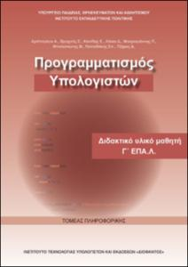

lass: cover-page, center, middle, inverse

ΠΡΟΓΡΑΜΜΑΤΙΣΜΟΣ
===========

## Γ' ΕΠΑΛ

### Τομέας Πληροφορικής



---
name: contents

## Περιεχόμενα

.contents[

]

---
layout: true

## Κεφάλαιο 3 - Βασικά στοιχεία γλώσσας προγραμματισμού

---

>Το **Ολοκληρωμένο Περιβάλλον Ανάπτυξης Προγραμμάτων** IDLE (Integrated 
DeveLopment Environment) της Python, είναι ένα Ελεύθερο Λογισμικό/ Λογισμικό Ανοικτού Κώδικα (ΕΛ/ΛΑΚ)

---
layout: true

## 3.1.1 Τύποι δεδομένων

---

>Οι τύποι δεδομένων προσδιορίζουν τον **τρόπο παράστασης** των δεδομένων εσωτερικά στον υπολογιστή, καθώς και το **είδος της επεξεργασίας** τους από αυτόν.

--- 

Οι χαρακτηριστικοί τύποι δεδομένων στην Python είναι:

- ο αριθμητικός.
    Οι αριθμοί στην Python είναι κυρίως τριών τύπων:
  - ακέραιοι (Integer)
  - αριθμοί κινητής υποδιαστολής (floating point)
  - μιγαδικοί αριθμοί (complex numbers), τύπος που δε θα μας απασχολήσει στη συνέχεια.
- ο λογικός (boolean): δέχεται μόνο δύο τιμές, την τιμή True (Αληθής) 
και την τιμή False (Ψευδής)

---

- οι συμβολοσειρές ή αλφαριθμητικά (strings): μια ακολουθία από χαρακτήρες. Μια συμβολοσειρά 
μπορεί να αποτελείται από περισσότερες από μία λέξεις. Μπορούμε να ορίσουμε μια συμβολοσειρά με μονά 
εισαγωγικά ή με διπλά, αλλά όχι ανάμικτα.

  -[Θέματα 2017 - Α1 Σωστό/Λάθος](https://apps1.minedu.gov.gr/themata/them_progyp_epal_c_hmer_170613.pdf)
  
  -[Θέματα 2024 - Α2 Αντιστοίχιση](https://apps1.minedu.gov.gr/themata/2024_06_them_sc_epal_240611.pdf)

.footnote[

]

---

### Άσκηση 1
> Για να ελέγξουμε τον τύπο δεδομένων χρησιμοποιούμε την συνάρτηση type().
```python
type(1)
type(3.14)
a = True
type(False)
type(‘Αρετή’)
```

-Τι θα εμφανίσει η κάθε γραμμή; Γιατί;

```python
# Παράδειγμα 1 - Ex01_first_prog.py
# -----------------------------
greeting = 'ΚΑΛΗΜΕΡΑ ΣΕ ΟΛΗ ΤΗΝ ΕΛΛΑΔΑ'
print greeting
```

-Τι σημαίνει η κάθε γραμμή;

-Τι θα εμφανίσει;

---

### Άσκηση 2
> Να αντιστοιχίσετε την στήλη Α με την στήλη Β
> 
| Στήλη Α (Τιμή) | Στήλη Β (Τύπος δεδομένων)|
-----------------|---------------------------
|1. -27 | Α. int (ακέραια) 
|2. 35.7 |Β. float (κινητής υποδιαστολής)
|3. ‘False’ | Γ. string (συμβολοσειρά) 
|4. True | Δ. bool (λογική)
|5. “432.12” 
|6. ‘μεταβλητή’ 
|7. 12 / 2 
|8. 20 % 3 

---

layout: true

## 3.2 Αριθμητικές και λογικές πράξεις και εκφράσεις

---

>Οι τελεστές (operators) είναι σύμβολα ή λέξεις για τη δημιουργία αριθμητικών και λογικών  εκφράσεων.

1.**Αριθμητικοί τελεστές**: Είναι τα σύμβολα που χρησιμοποιούμε για να κάνουμε 
μαθηματικές πράξεις.

|Τελεστής | Σύμβολο |
| ---------- | ----------- |
| Πρόσθεση | + |
| Αφαίρεση | - |
| Πολλαπλασιασμός | * |
| Διαίρεση | / |
| Ύψωση σε δύναμη | ** |
| Το υπόλοιπο της ακέραιας διαίρεσης | %|

---

2.**Σχεσιακοί** (ή συγκριτικοί) **τελεστές**: χρησιμοποιούνται για τη σύγκριση δύο τιμών ή μεταβλητών, με το αποτέλεσμα μιας σύγκρισης να είναι είτε True (Αληθής) είτε False (Ψευδής).

| Τελεστής | Σύμβολο |
| ---------- | ----------- |
| Μικρότερο από           |     <  |
| Μικρότερο ή ίσο από    |     <=  |
| Μεγαλύτερο από        |       >  |
| Μεγαλύτερο ή ίσο από |       >=  |
| Ίσο με       |                == |
| Διάφορο από |                 != |

---

3.**Τελεστές λογικών πράξεων**: Στις λογικές πράξεις και εκφράσεις χρησιμοποιούνται οι λογικοί τελεστές not (ΟΧΙ), and (ΚΑΙ), or (Ή) 

| P   | Q   | P and Q   | P or Q   | Not P |
| --- | --- | --------- | ------- | ----------- |
| True | True | True | True | False |
| True | False | False | True | False |
| False | True | False | True | True |
| False | False | False | False | True |

---

### Ιεραρχία των πράξεων

1. Παρενθέσεις
2. Ύψωση σε δύναμη
3. Πολλαπλασιασμός, διαίρεση, υπόλοιπο ακέραιας διαίρεσης
4. Πρόσθεση, αφαίρεση
5. <, >, <=, >=, ==, !=
6. not
7. and
8. or

---

### Μεταβλητές

- δεν απαιτείται η δήλωσή της
- μπορεί να εκχωρήσουμε διαφορετικούς τύπους τιμών
- απαιτείται να της δώσουμε ένα όνομα
  - δεν επιτρέπεται να ξεκινά το όνομα μιας μεταβλητής με αριθμό. 
  - ξεκινάει πάντα με γράμμα ή με το underscore (κάτω παύλα) _ δηλαδή πρέπει να είναι (A-z, 0-9, και _ )
  - δεν πρέπει να είναι όμοιο με κάποιο όνομα ενσωματωμένης συνάρτησης ή εντολής
  
|      |        |            |     |      |        |            |     |
| ---- | ----- |----- | ------ | ------- | -------- | ------------ | ------ |
| and |    as|    assert|    break|  class | continue | def | del |
| elif | else | except | FALSE | finally | for | from | global |
| if | import | in | is |  lambda | None |  nonlocal | not |
| or | pass | raise | return | TRUE | try | while | with |
| yield |
    
  - το όνομα είναι case-sensitive. Υπάρχει διάκριση πεζών-κεφαλαίων (δηλαδή είναι διαφορετικά το age από το Age και το AGe)
- εκχώρηση τιμής με το ίσον =
```python
a = 222 #βάζω την τιμή 222 στην μεταβλητή με όνομα a.
```
---

### Παραδείγματα για εξάσκηση στις μεταβλητές (1/2)

**Παράδειγμα 1: Δημιουργία μεταβλητών**  
   Δημιουργήστε μεταβλητές που να περιέχουν τις παρακάτω τιμές και εκτυπώστε τις:
   - Έναν ακέραιο αριθμό (π.χ., 42)
   - Έναν αριθμό κινητής υποδιαστολής (π.χ., 3.14)
   - Μια συμβολοσειρά (π.χ., "Καλημέρα")
   - Μια λογική τιμή (π.χ., `True`)

   ```python
   # Παράδειγμα
   x = 42
   print x
   ```

**Παράδειγμα 2: Έλεγχος τύπου δεδομένων**  
   Χρησιμοποιήστε τη συνάρτηση `type()` για να ελέγξετε τον τύπο των παρακάτω τιμών: `123`, `45.67`, `"Python"`, `False`
   ```python
   # Παράδειγμα
   print type(123) 
   ```

---

### Παραδείγματα για εξάσκηση στις μεταβλητές (2/2)

**Παράδειγμα 3: Εγκυρότητα ονομάτων μεταβλητών**  
   Ποια από τα παρακάτω ονόματα μεταβλητών είναι έγκυρα; Δοκιμάστε να τα χρησιμοποιήσετε στον κώδικά σας: `1name`, `_name`, `name_1`, `class`, `myVariable`

   ```python
   # Παράδειγμα
   _name = "Εγκυρο"
   print _name
   ```

**Παράδειγμα 4: Εκχώρηση τιμών**  
   Δημιουργήστε μια μεταβλητή με όνομα `a` και εκχωρήστε της την τιμή 10. Στη συνέχεια, αλλάξτε την τιμή της σε:
  `20` , `"Hello"` , `False` 


   ```python
   # Παράδειγμα
   a = 10
   print a
   a = 20
   print a
   ```

**Παράδειγμα 5: Διάκριση πεζών-κεφαλαίων**  
   Δημιουργήστε δύο μεταβλητές με τα ονόματα `age` και `Age`. Εκχωρήστε διαφορετικές τιμές σε καθεμία και εκτυπώστε τις. Τι παρατηρείτε;

   ```python
   # Παράδειγμα
   age = 25
   Age = 30
   print age
   print Age
   ```

---

### Άσκηση 3
> Πληκτρολογήστε τα παρακάτω ονόματα μεταβλητών στην Python 2.7 και γράψτε Σωστό ή Λάθος αν το όνομα της μεταβλητής είναι ένα έγκυρο όνομα μεταβλητής ή όχι.
> Επίσης εξηγήστε ποιος κανόνας δεν ικανοποιείται.

| Όνομα μεταβλητής | Σωστό/Λάθος |
| ----------------- | --------------------------- |
| x!b | |
| Metavliti3 | |
| Metavliti+3 | |
| Kila 2 | |
| mikos_1 | |
| 245 | |
| 1onoma | |
| Print | |

---

### Άσκηση 3
> Γράψτε το αποτέλεσμα των παρακάτω εντολών πριν την εκτέλεση τους στην Python 2.7. Μετά εκτελέστε τα και παρατηρήστε τις διαφορές. Εξηγήστε γιατί.

Α.
```python
x = 35
y = 10
x = x / y
print x
```
B.
```python
x = 45
y = 10
divmod(x,y)
```
> [Δείτε παραδείγματα για divmod](https://www.geeksforgeeks.org/divmod-python-application/)

---

### Άσκηση 3
> Γράψτε το αποτέλεσμα των παρακάτω εντολών πριν την εκτέλεση τους στην Python 2.7. Μετά εκτελέστε τα και παρατηρήστε τις διαφορές. Εξηγήστε γιατί.

Γ.
```python
a = 0xB
print a
```

Δ.
```python
x,y,z = 1, 4, "today"
print z, x
```

Ε.
```python
x = 234
y = 456.7
x,y = y,x
print x
print y
```

---

### Άσκηση 3
> Γράψτε το αποτέλεσμα των παρακάτω εντολών πριν την εκτέλεση τους στην Python 2.7. Μετά εκτελέστε τα και παρατηρήστε τις διαφορές. Εξηγήστε γιατί.

ΣΤ.
```python
x = 2
x = 2 **3 + 2/3
print x
x = 2 **3 + 2/ float(3)
print x
```

Z.
```python
x = 2
x -= 1
x = x - 1
print x
```

---

### Η εντολή print

- Χρησιμοποιείται για την εκτύπωση δεδομένων στην οθόνη.
- Συντάσσεται ως:
  ```python
  print <έκφραση ή τιμή>
  ```
- Παραδείγματα:
  ```python
  print "Καλημέρα!"
  print 42
  print 3.14
  print True
  ```

---

### Παραδείγματα με την print

1. Εκτύπωση πολλαπλών τιμών:
   ```python
   print "Το αποτέλεσμα είναι:", 42
   ```

2. Εκτύπωση με escape χαρακτήρες:
   ```python
   print "Γραμμή 1\nΓραμμή 2"
   ```

3. Εκτύπωση μεταβλητών:
   ```python
   x = 10
   y = 20
   print "Το x είναι:", x, "και το y είναι:", y
   ```

---

### Η εντολή input

- Χρησιμοποιείται για την εισαγωγή δεδομένων από τον χρήστη.
- Συντάσσεται ως:
  ```python
  variable = input("Μήνυμα προς τον χρήστη: ")
  ```
- Επιστρέφει την τιμή που εισάγει ο χρήστης.

**Διαφορά με Python 3**:  
Στην Python 2.7, η `raw_input()` επιστρέφει πάντα μια συμβολοσειρά (string). Αν χρειάζεται αριθμητική τιμή, πρέπει να γίνει μετατροπή με `int()` ή `float()`.  
Παράδειγμα:
```python
x = int(input("Δώσε έναν αριθμό: "))  # Μετατροπή σε ακέραιο
```
---

### Παραδείγματα με την input

1. Εισαγωγή και πράξεις:
   ```python
   a = input("Δώσε τον πρώτο αριθμό: ")
   b = input("Δώσε τον δεύτερο αριθμό: ")
   print "Το άθροισμα είναι:", a + b
   ```

2. Εισαγωγή συμβολοσειράς:
   ```python
   name = input("Πώς σε λένε; ")
   print "Γεια σου,", name
   ```
--- 

---
layout: true

## 3.3 Βασικές ενσωματωμένες συναρτήσεις

---

>Η Python παρέχει ορισμένες **βασικές ενσωματωμένες συναρτήσεις** που χρησιμοποιούνται συχνά στα προγράμματα.

### Χαρακτηριστικά:
- Είναι έτοιμες προς χρήση.
- Δέχονται ορίσματα (τιμές μέσα στις παρενθέσεις).
- Επιστρέφουν πάντα μια τιμή.

---

### Η συνάρτηση float()

- Μετατρέπει ένα δεδομένο σε αριθμό κινητής υποδιαστολής.

**Σύνταξη:**
```python
float(x)
```

**Παραδείγματα:**
```python
print float(5)      # 5.0
print float("3.14") # 3.14
```
---

### Η συνάρτηση int()

Μετατρέπει ένα δεδομένο σε ακέραιο αριθμό (κόβει τα δεκαδικά).

**Σύνταξη:**
```python
int(x)
```

**Παράδειγμα:**
```python
print int(7.9)     # 7
print int("42")    # 42
```
---

### Η συνάρτηση str()

- Μετατρέπει ένα δεδομένο σε συμβολοσειρά.

**Σύνταξη:**
```python
str(x)
```

**Παράδειγμα:**
```python
print str(123)     # "123"
print str(3.14)    # "3.14"
```

---

### Η συνάρτηση abs()

- Επιστρέφει την απόλυτη τιμή ενός αριθμού.

**Σύνταξη:**
```python
abs(x)
```

**Παράδειγμα:**
```python
print abs(-10)   # 10
print abs(4.5)   # 4.5
```

---

### Η συνάρτηση pow()

- Επιστρέφει το αποτέλεσμα ύψωσης σε δύναμη.

**Σύνταξη:**
```python
pow(x, y)
```

**Παράδειγμα:**
```python
print pow(2, 3)   # 8
print pow(5, 2)   # 25
```

---

### Η συνάρτηση divmod()

- Επιστρέφει το πηλίκο και το υπόλοιπο μιας διαίρεσης σε μορφή πλειάδας (tuple).

**Σύνταξη:**
```python
divmod(a, b)
```

**Παράδειγμα:**
```python
print divmod(10, 3)   # (3, 1)
print divmod(20, 5)   # (4, 0)
```

---

### Άσκηση 4

> Γράψτε τι θα εμφανίσει το παρακάτω πρόγραμμα:

```python
x = -7.5
print abs(x)
print int(x)
print float(10)
print str(25)
print pow(2, 4)
print divmod(17, 5)
```

---

### Άσκηση 5

> Να συμπληρώσετε τον πίνακα:

| Εντολή | Αποτέλεσμα |
| ------- | ---------- |
| abs(-12) | |
| int(3.99) | |
| float("8.5") | |
| str(123) | |
| pow(2, 5) | |
| divmod(20, 6) | |
---

### Εξωτερικές βιβλιοθήκες

---

>Η Python διαθέτει πολλές **εξωτερικές βιβλιοθήκες** που περιέχουν έτοιμες συναρτήσεις για εξειδικευμένους υπολογισμούς.

- Για να χρησιμοποιήσουμε μια βιβλιοθήκη, πρέπει πρώτα να την εισάγουμε με την εντολή:
```python
import <όνομα_βιβλιοθήκης>
```

- Η βιβλιοθήκη **math** παρέχει μαθηματικές συναρτήσεις.

---

### Παράδειγμα 1: Τετραγωνική ρίζα (sqrt)

```python
import math

x = 16
print math.sqrt(x)   # 4.0
```

---

### Παράδειγμα 2: Η σταθερά π (pi)

```python
import math

print math.pi         # 3.141592653589793
r = 5
perimetros = 2 * math.pi * r
print perimetros      # 31.4159...
```
---

layout: true

## 3.4 Δομή προγράμματος και καλές πρακτικές

---

### Καλές πρακτικές στη συγγραφή προγραμμάτων

- Βάζουμε έναν τίτλο στο πρόγραμμα με σχόλια (`#`).
- Χρησιμοποιούμε σωστά τα κενά διαστήματα (indentation).
- Επιλέγουμε τους κατάλληλους τελεστές.
- Χρησιμοποιούμε πάντα τα ίδια εισαγωγικά (μονά ή διπλά).

---

### Σχόλια και κατανόηση κώδικα

- Προσθέτουμε σχόλια για να εξηγήσουμε τον κώδικα.
- Τα σχόλια αγνοούνται από τον υπολογιστή.
- Βοηθούν στην κατανόηση και συντήρηση του προγράμματος.

**Παράδειγμα:**
```python
# Πρόγραμμα υπολογισμού εμβαδού ορθογωνίου
width = 5
height = 10
area = width * height  # υπολογισμός εμβαδού
print area
```

---

### Ονόματα μεταβλητών

- Τα ονόματα πρέπει να δείχνουν τον ρόλο τους.
- Διευκολύνουν την κατανόηση του κώδικα.

**Παράδειγμα:**
```python
# Κακό παράδειγμα
x = 5
y = 10
z = x * y

# Καλό παράδειγμα
width = 5
height = 10
area = width * height
```

---
 [themata_2024]: https://apps1.minedu.gov.gr/themata/2024_06_them_sc_epal_240611.pdf
 [themata_2023]: https://apps1.minedu.gov.gr/themata/202306_programming_epal_230610.pdf
 [themata_2022]: https://apps1.minedu.gov.gr/themata/them_prog_epal_220611.pdf
 [themata_2021]: https://apps1.minedu.gov.gr/themata/06_PROGRAMMATISMOS_YPOLOGISTWN_2021.pdf
 [themata_2020]: https://apps1.minedu.gov.gr/themata/them_ProgHY_epal_200627.pdf
 [themata_2019]: https://apps1.minedu.gov.gr/themata/them_progyp_epal_c_hmer_190611.pdf
 [themata_2018]: https://apps1.minedu.gov.gr/themata/them_progyp_epal_c_hmer_180620.pdf
 [themata_2017]: https://apps1.minedu.gov.gr/themata/them_progyp_epal_c_hmer_170613.pdf